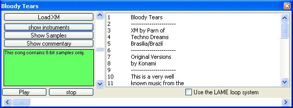



## Xm\-player \(fasttracker 2\.0\)

### Description

This code playes fasttracker 2.0 files (XM = Extended Module).FastTracker 2 was one of the first music composition tools for PC and it still delivers a great sound experience, due to the ability of using 8-16 bit samples. it was the first tracker to implement instruments thus enabling the user to automate volume and panning.

Caution this code sample does not yet support 16-bit samples but it does support 8-bit samples. the .zip file contains test music.
 
### More Info
 

             |
---                |---
**Submitted On**   |2006-02-12 21:11:42
**By**             |[Lars Åkesson](https://github.com/Planet-Source-Code/PSCIndex/blob/master/ByAuthor/lars-kesson.md)
**Level**          |Intermediate
**User Rating**    |5.0 (15 globes from 3 users)
**Compatibility**  |VB 6\.0
**Category**       |[Sound/MP3](https://github.com/Planet-Source-Code/PSCIndex/blob/master/ByCategory/sound-mp3__1-45.md)
**World**          |[Visual Basic](https://github.com/Planet-Source-Code/PSCIndex/blob/master/ByWorld/visual-basic.md)
**Archive File**   |[Xm\-player\_1974392182006\.zip](https://github.com/Planet-Source-Code/lars-kesson-xm-player-fasttracker-2-0__1-64374/archive/master.zip)

